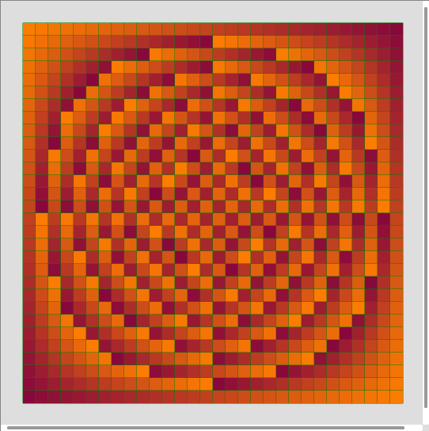

# Restklassenmaker/Residue class visualizer #

General
-------
The Residue Class Visualizer generates residue classes based on user input. The User is able to zoom in bigger residue classes.

Screenshots
-----------

